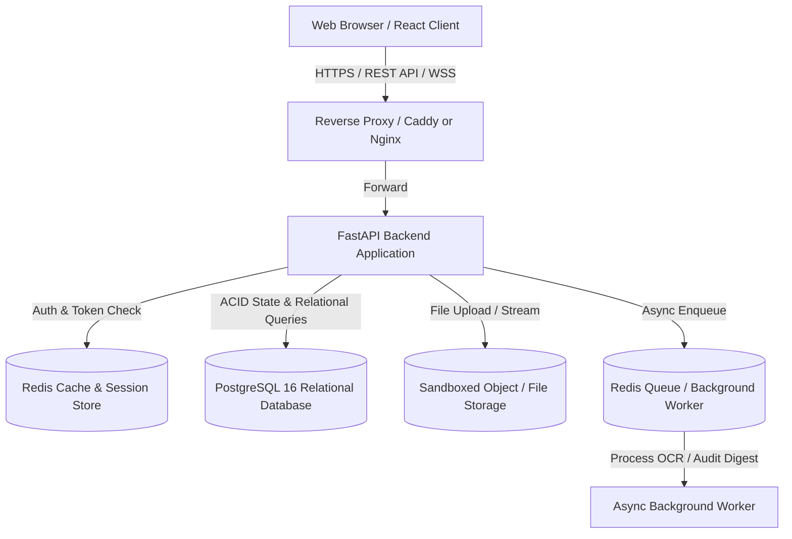
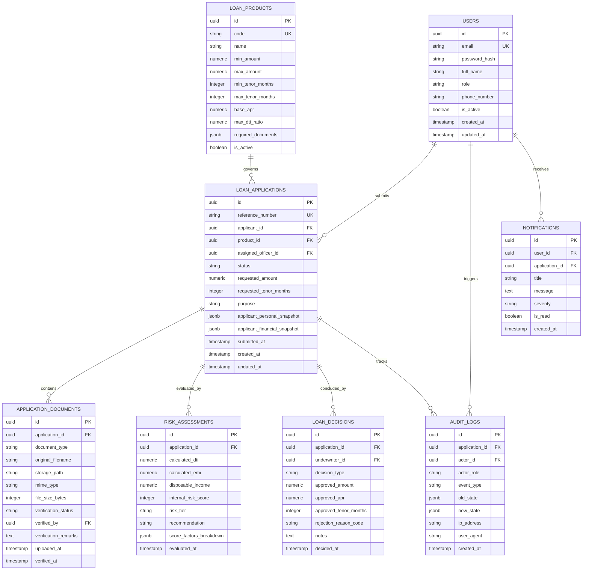
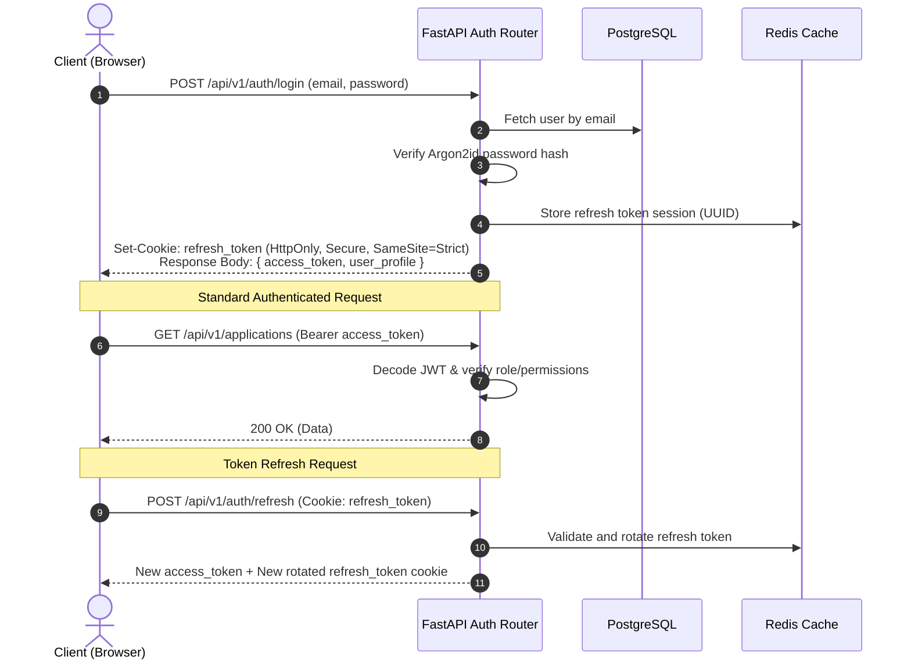

# System Architecture Document (ARCHITECTURE.md)
## System: Loan Approval Processing System (LAPS)

- **Document Version:** 1.0.0
- **Status:** Approved for Implementation
- **Last Updated:** 2026-09-10

---

## 1. Executive Summary & Stack Selection Justification

The **Loan Approval Processing System (LAPS)** is architected as a modern, decoupled, multi-tiered full-stack system designed for high reliability, deterministic financial data processing, strict auditability, and bank-grade security.



### 1.1 Selected Technology Stack

| Layer | Selected Technology | Technical Justification |
| :--- | :--- | :--- |
| **Frontend Framework** | **React 18+ with TypeScript** | Industry standard for enterprise interfaces; strong static type safety, component reusability, and vast ecosystem for complex workflows. |
| **Frontend Build Tool** | **Vite** | Sub-second hot module replacement (HMR), optimized tree-shaking, lightweight modern bundling. |
| **Styling & Tokens** | **Tailwind CSS** | Deterministic token-based utility system enabling rapid implementation of the fintech design system in `DESIGN.md`. |
| **State & Data Fetching**| **TanStack Query (React Query) + Zustand** | Server-state caching, automatic background refetching, optimistic updates for state transitions, paired with lightweight Zustand for client UI state. |
| **Backend Framework** | **FastAPI (Python 3.11+)** | High performance via ASGI (`uvicorn`), native asynchronous I/O, automatic OpenAPI documentation, and strict schema validation via Pydantic v2. |
| **Data Validation** | **Pydantic v2** | Rust-backed blazing-fast validation engine ensuring zero malformed payloads enter the business logic or financial calculations. |
| **ORM & Database Client**| **SQLAlchemy 2.0 (Async) + Alembic** | Enterprise relational mapping, async session management, strict type hints, and version-controlled automated database migrations. |
| **Primary Database** | **PostgreSQL 16** | Robust ACID transactional guarantees, strong foreign key constraints, JSONB support for flexible audit snapshots, and row-level locking. |
| **In-Memory Cache / Queue**| **Redis 7** | Sub-millisecond token blacklisting, rate limiting, and message queue for asynchronous document processing and notifications. |
| **Document Storage** | **S3-Compatible Object Storage (MinIO / Local Mock Abstraction)** | Isolates binary blobs from the relational database; allows secure time-limited presigned URLs. |
| **Containerization** | **Docker & Docker Compose** | Reproducible, isolated environments across development, staging, and production. |

---

## 2. High-Level Architectural Layers

LAPS enforces strict layered architecture to prevent tight coupling and preserve testability.

```
┌─────────────────────────────────────────────────────────────┐
│                 Presentation Layer (React UI)               │
│   Pages • Steppers • Tables • Dashboards • Modals • Toasts  │
└──────────────────────────────┬──────────────────────────────┘
                               │ JSON over HTTPS (REST API)
┌──────────────────────────────▼──────────────────────────────┐
│                    API Routing Layer (FastAPI)              │
│     CORS • Rate Limiting • Auth Guards • Error Envelopes    │
└──────────────────────────────┬──────────────────────────────┘
                               │ Typed DTOs / Schemas
┌──────────────────────────────▼──────────────────────────────┐
│                 Domain / Service Logic Layer                │
│  State Machine • Risk Engine • Doc Verification • Auditing  │
└──────────────────────────────┬──────────────────────────────┘
                               │ Domain Entities / Repositories
┌──────────────────────────────▼──────────────────────────────┐
│               Data Persistence Layer (SQLAlchemy 2.0)       │
│           PostgreSQL Relational Storage • Redis Cache       │
└─────────────────────────────────────────────────────────────┘
```

---

## 3. Database Architecture & Data Models

### 3.1 Entity Relationship Diagram (ERD)



### 3.2 Key Database Design Standards
1. **Primary Keys:** UUIDv4 generated at application or DB level (`gen_random_uuid()`) to prevent enumeration attacks.
2. **Monetary Values:** Stored as `NUMERIC(14, 2)` (never float) to guarantee exact decimal precision for financial amounts and interest rates.
3. **Audit Immutability:** `AUDIT_LOGS` table has no `UPDATE` or `DELETE` permissions granted to the standard application database user.
4. **Optimistic Concurrency Control:** `LOAN_APPLICATIONS` includes an integer `version` or timestamp column to detect and reject concurrent modifications by multiple officers.

---

## 4. Authentication, Authorization & Security Architecture

### 4.1 Authentication Flow (JWT + Refresh Rotation)


### 4.2 Role-Based Access Control (RBAC) Matrix

| Resource / Endpoint | `APPLICANT` | `LOAN_OFFICER` | `RISK_ANALYST` | `ADMIN` |
| :--- | :---: | :---: | :---: | :---: |
| `POST /auth/register` | Open | Open | Open | Open |
| `POST /applications` (Submit) | Own Only | ✕ | ✕ | ✕ |
| `GET /applications/my` | Own Only | ✕ | ✕ | ✕ |
| `GET /applications/queue` | ✕ | Full Queue | Full Queue | Full Queue |
| `GET /applications/{id}` | Own Only | Assigned/All | Assigned/All | Full Access |
| `PATCH /applications/{id}/assign` | ✕ | Self-assign | ✕ | Any Officer |
| `POST /applications/{id}/documents` | Own Only | ✕ | ✕ | ✕ |
| `PATCH /documents/{id}/verify` | ✕ | Read/Verify | Read/Inspect | Full Access |
| `POST /applications/{id}/evaluate-risk`| ✕ | ✕ | Execute/Inspect | Execute/Inspect |
| `POST /applications/{id}/decision` | ✕ | ✕ | Approve/Reject | Approve/Reject |
| `POST /applications/{id}/disburse` | ✕ | ✕ | ✕ | Disburse Only |
| `GET /audit-logs` | ✕ | ✕ | ✕ | Full Access |
| `CRUD /products` | Read Only | Read Only | Read Only | Full Access |

---

## 5. Subsystem Architecture

### 5.1 Deterministic Risk & Eligibility Engine
The risk assessment module is encapsulated in a dedicated pure-function domain service:
- **Input:** Application financial snapshot (`gross_monthly_income`, `existing_debts`, `housing_expenses`), requested loan terms (`amount`, `tenor`), and product limits (`max_dti`, `base_apr`).
- **Processing:**
  1. Computes monthly EMI via exact standard amortization formula.
  2. Computes Debt-to-Income (DTI) ratio.
  3. Computes Disposable Income Cushion.
  4. Evaluates weighted scoring matrix (Income stability, employment duration, debt ratio tier, declared credit profile).
  5. Determines risk tier (`LOW`, `MEDIUM`, `HIGH`) and automated underwriting recommendation (`APPROVE`, `REFER`, `REJECT`).
- **Output:** Immutable `RiskAssessmentResult` object stored with application dossier.

### 5.2 Document Management Subsystem
- **Validation Pipeline:**
  1. Header and MIME type inspection using `python-magic` (rejection of spoofed `.exe` or malformed files).
  2. File size limit enforcement (max 10MB).
  3. Sanitization of original filename and assignment of non-guessable UUID storage key (`storage/docs/{app_id}/{uuid}.pdf`).
- **Serving Mechanism:**
  - Documents are never directly exposed via public static web paths.
  - Documents are streamed via authenticated endpoints checking user access privilege (`GET /api/v1/documents/{id}/download`).

### 5.3 Audit Logging Engine
- Implemented as a database-driven event hook and FastAPI dependency.
- Every state transition, document status update, and underwriter decision automatically writes to `AUDIT_LOGS` within the same database transaction.
- Captures before/after delta snapshots in JSONB format.

---

## 6. Proposed Project Directory Structure

```text
loan-approval-processing-system/
├── PRD.md
├── AGENTS.md
├── DESIGN.md
├── ARCHITECTURE.md
├── RULES.md
├── MEMORY.md
├── DECISIONS.md
├── TESTING.md
├── docker-compose.yml
├── .env.example
├── .gitignore
│
├── backend/
│   ├── Dockerfile
│   ├── pyproject.toml
│   ├── alembic.ini
│   ├── alembic/
│   │   ├── env.py
│   │   └── versions/
│   └── app/
│       ├── __init__.py
│       ├── main.py
│       ├── core/
│       │   ├── config.py             # Environment & settings
│       │   ├── security.py           # JWT & password hashing
│       │   ├── database.py           # Async engine & sessionmaker
│       │   └── exceptions.py         # Custom HTTP exceptions
│       ├── api/
│       │   ├── v1/
│       │   │   ├── router.py
│       │   │   ├── endpoints/
│       │   │   │   ├── auth.py
│       │   │   │   ├── applications.py
│       │   │   │   ├── documents.py
│       │   │   │   ├── risk.py
│       │   │   │   ├── decisions.py
│       │   │   │   ├── products.py
│       │   │   │   ├── audit.py
│       │   │   │   └── notifications.py
│       │   └── deps.py               # Auth & role dependencies
│       ├── models/                   # SQLAlchemy ORM models
│       │   ├── user.py
│       │   ├── product.py
│       │   ├── application.py
│       │   ├── document.py
│       │   ├── risk.py
│       │   ├── decision.py
│       │   ├── audit.py
│       │   └── notification.py
│       ├── schemas/                  # Pydantic validation schemas
│       │   ├── auth.py
│       │   ├── application.py
│       │   ├── document.py
│       │   ├── risk.py
│       │   ├── decision.py
│       │   └── audit.py
│       ├── services/                 # Business logic services
│       │   ├── auth_service.py
│       │   ├── application_service.py
│       │   ├── state_machine.py      # Lifecycle FSM
│       │   ├── risk_engine.py        # Deterministic scoring
│       │   ├── document_service.py
│       │   └── audit_service.py
│       └── tests/                    # Backend test suite
│           ├── conftest.py
│           ├── unit/
│           └── integration/
│
└── frontend/
    ├── Dockerfile
    ├── package.json
    ├── tsconfig.json
    ├── vite.config.ts
    ├── tailwind.config.js
    └── src/
        ├── main.tsx
        ├── App.tsx
        ├── api/                      # API client & endpoints
        │   ├── client.ts
        │   ├── auth.ts
        │   └── applications.ts
        ├── assets/
        ├── components/               # Reusable UI library
        │   ├── ui/                   # Buttons, Badges, Modals, Inputs
        │   ├── forms/                # Steppers, form fields
        │   ├── layout/               # Shell, Topbar, Sidebar
        │   └── feedback/             # Skeletons, Toasts, EmptyStates
        ├── context/                  # AuthContext, ThemeContext
        ├── hooks/                    # useAuth, useApplicationQueue
        ├── pages/                    # Route page components
        │   ├── auth/
        │   ├── applicant/            # Portal, New Application, Status
        │   ├── staff/                # Queue, Verification, Underwriting
        │   └── admin/                # Settings, Audit Log, Products
        ├── types/                    # TypeScript interfaces
        └── utils/                    # Currency, Date, Amortization helpers
```

---

## 7. Operational & Deployment Architecture

### 7.1 Development Environment
- Multi-container setup managed via `docker-compose.yml`:
  - `postgres`: PostgreSQL 16 on port `5432` with healthcheck.
  - `redis`: Redis 7 on port `6379`.
  - `backend`: FastAPI with hot-reload enabled (`uvicorn --reload`).
  - `frontend`: Vite development server with proxy forwarding `/api` to backend.

### 7.2 Production Deployment Target
- Stateless backend containers scaled behind reverse proxy (Caddy/Nginx) with automatic TLS.
- Database hosted on managed PostgreSQL with automated daily snapshots and connection pooling (`pgbouncer`).
- Static frontend assets served via CDN / web server.
