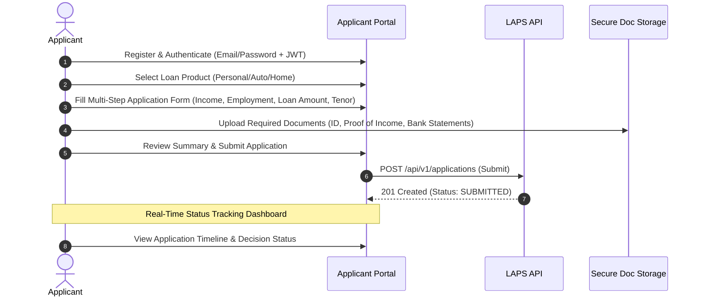
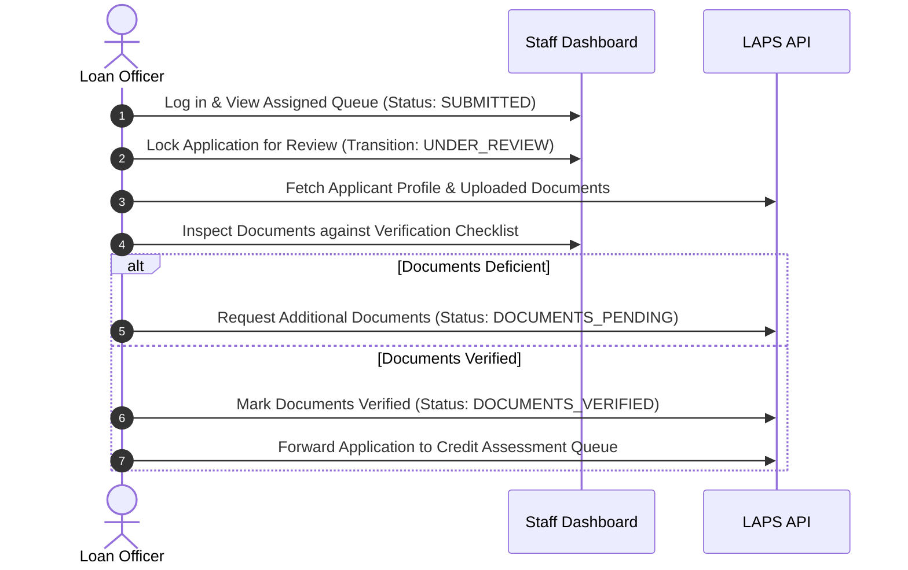
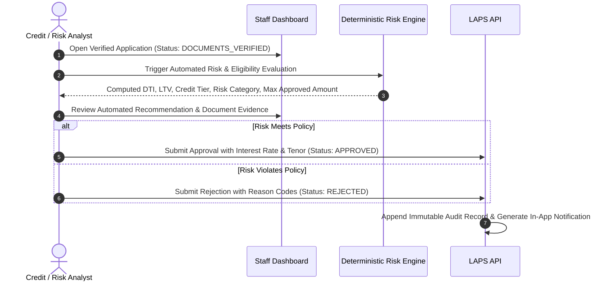
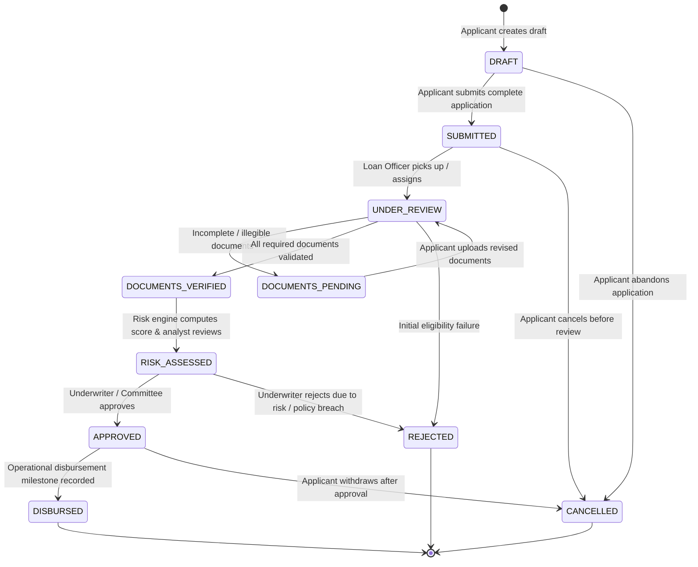

# Product Requirements Document (PRD)
## Project: Loan Approval Processing System (LAPS)

- **Document Version:** 1.0.0
- **Status:** Approved for Architecture & Planning
- **Last Updated:** 2026-09-10
- **Owner:** Lead Software Architect & Product Planning Team

---

## 1. Executive Summary & Product Vision

### 1.1 Product Vision
The **Loan Approval Processing System (LAPS)** is a secure, compliant, and auditable full-stack financial platform designed to manage the entire lifecycle of retail and commercial loan applications. LAPS transitions lending institutions from fragmented, paper-heavy, manual underwriting processes to a streamlined, automated, and deterministic digital workflow. 

The platform guarantees data integrity, role-based governance, transparent eligibility evaluation, and end-to-end auditability from initial application submission to final disbursement or rejection.

### 1.2 Problem Statement
Modern financial organizations and non-banking financial companies (NBFCs) struggle with:
1. **Inefficient manual handoffs:** Disconnected communication between loan officers, risk underwriters, and applicants creates application bottlenecks and long turnaround times (TAT).
2. **Opaque eligibility & risk scoring:** Undocumented heuristics cause inconsistent loan underwriting and compliance vulnerabilities.
3. **Document management friction:** Insecure document sharing and lack of structured verification checklists increase processing delays and compliance risks.
4. **Audit and compliance exposure:** Lack of immutable event trails leaves institutions vulnerable during regulatory audits.

### 1.3 Strategic Goals
- **Reduce Application Turnaround Time (TAT):** Streamline handoffs to cut review cycles by 60%.
- **Deterministic Underwriting:** Provide automated, reproducible pre-qualification and risk scoring based on explicit business rules.
- **Robust Role-Based Access Control (RBAC):** Strict operational boundaries separating Applicants, Loan Officers, Risk Analysts, and Administrators.
- **Audit-Ready Operations:** Every application status change, note, document review, and decision must generate an immutable audit log entry.
- **Production-Grade Architecture:** Built with clean domain-driven separation, extensible state machines, and bank-grade data security.

### 1.4 Non-Goals (Out of Scope for Initial Phases)
- **Live External Banking/Bureau Integrations:** Real-time API integrations with third-party credit bureaus (e.g., CIBIL, Experian, Equifax) or government identity systems (e.g., Aadhaar, PAN, SSN verification APIs) are **out of scope** for the MVP. The system will use deterministic internal risk scoring and applicant-supplied verified data.
- **Automated Payment Gateway/ACH Disbursement:** Direct bank wire integration and automated clearing house (ACH) network transactions are out of scope. Disbursement status in LAPS is recorded as an operational milestone.
- **Debt Collection & Servicing Platform:** Post-disbursement loan amortization tracking, delinquency recovery, and legal collection workflows belong to dedicated Loan Management Systems (LMS) and are not part of LAPS.
- **Multi-tenant SaaS Marketplace:** The current release focuses on a single-institution enterprise deployment model.

---

## 2. Target Users and Personas

| Role | Target Persona | Primary Objectives | Key Pain Points |
| :--- | :--- | :--- | :--- |
| **Applicant / Customer** | Retail borrower or small business owner seeking personal, auto, or home loans. | Submit loan applications effortlessly, track real-time progress, upload verified documents, and view clear decision rationales. | Opaque loan status, lost documents, repeated requests for identical information, unexplained rejections. |
| **Loan Officer** | Relationship manager or front-desk lending staff. | Triage incoming applications, verify basic eligibility and completeness, validate uploaded documents, and prepare applications for risk review. | High inbox clutter, missing applicant contact details, lack of automated validation on uploaded files. |
| **Credit / Risk Analyst** | Underwriter or quantitative risk assessor. | Perform detailed credit assessment, inspect debt-to-income (DTI) and loan-to-value (LTV) metrics, evaluate risk scoring, and recommend approval or rejection. | Inconsistent data formats, absence of automated financial metric calculation, insufficient audit history. |
| **Administrator** | Compliance manager, IT supervisor, or head of credit operations. | Configure loan products, adjust risk thresholds, manage staff user accounts, view system analytics, and inspect immutable audit logs. | Lack of visibility into underwriting bottlenecks, manual staff onboarding, difficult regulatory compliance reporting. |

---

## 3. User Journeys

### 3.1 Applicant Journey

### 3.2 Loan Officer Review & Verification Journey

### 3.3 Risk Assessment & Final Approval Journey

---

## 4. Loan Application Lifecycle & State Machine

Every application adheres to a deterministic, finite state machine (FSM). Unauthorized or skipped state transitions are strictly rejected by the backend validation layer.

### 4.1 State Definitions & Transition Rules

| State | Allowed Next States | Trigger / Actor | Condition / Validation |
| :--- | :--- | :--- | :--- |
| `DRAFT` | `SUBMITTED`, `CANCELLED` | Applicant | All mandatory initial fields must be populated before transitioning to `SUBMITTED`. |
| `SUBMITTED` | `UNDER_REVIEW`, `CANCELLED` | Loan Officer / Applicant | Assigned to staff member or unassigned pool; locks draft from further applicant editing. |
| `UNDER_REVIEW` | `DOCUMENTS_PENDING`, `DOCUMENTS_VERIFIED`, `REJECTED` | Loan Officer | Officer reviews applicant identity, declared income, and document attachments. |
| `DOCUMENTS_PENDING` | `UNDER_REVIEW`, `CANCELLED` | Applicant / System | Triggers notification to applicant detailing missing or rejected documents. |
| `DOCUMENTS_VERIFIED`| `RISK_ASSESSED`, `REJECTED` | Loan Officer / Risk Analyst | All mandatory documents marked `VERIFIED`. |
| `RISK_ASSESSED` | `APPROVED`, `REJECTED` | Credit / Risk Analyst | Automated risk rules computed; analyst verifies risk tier and limits. |
| `APPROVED` | `DISBURSED`, `CANCELLED` | Loan Officer / Admin | Formal offer parameters recorded (approved amount, rate, tenor, conditions). |
| `REJECTED` | None (Terminal) | Loan Officer / Risk Analyst | Rejection reason code and detailed justification mandatory. |
| `DISBURSED` | None (Terminal) | Admin / Finance Officer | Reference ID and disbursement date recorded. |
| `CANCELLED` | None (Terminal) | Applicant / Admin | Cancellation reason logged; only permitted prior to disbursement. |

---

## 5. Functional Requirements

### 5.1 Authentication and Access Governance
- **FR-AUTH-01:** System shall support email and password authentication with salted hashing (Argon2id or bcrypt).
- **FR-AUTH-02:** System shall issue stateless JWT access tokens (short-lived, e.g., 15 minutes) and rotating secure HTTP-only refresh tokens (e.g., 7 days).
- **FR-AUTH-03:** System shall enforce Role-Based Access Control (RBAC) across four standard roles:
  - `APPLICANT`: Can only read/write their own applications, documents, and notifications.
  - `LOAN_OFFICER`: Can read assigned/unassigned applications, verify documents, and transition states up to `DOCUMENTS_VERIFIED`.
  - `RISK_ANALYST`: Can execute risk evaluations, view detailed financial metrics, and transition states to `APPROVED` or `REJECTED`.
  - `ADMIN`: Full access to configuration, user management, audit logs, and override capabilities with audit logging.
- **FR-AUTH-04:** Password policies must enforce a minimum of 10 characters, at least one uppercase letter, one lowercase letter, one digit, and one special character.
- **FR-AUTH-05:** System shall provide role-scoped authorization checks on every endpoint (`@require_roles(...)`).

### 5.2 Loan Product Configuration
- **FR-PROD-01:** Administrators shall be able to configure distinct loan products (e.g., Personal Loan, Auto Loan, Small Business Loan).
- **FR-PROD-02:** Each loan product defines:
  - Minimum and maximum loan amount.
  - Minimum and maximum tenor (months).
  - Base interest rate (annual percentage rate - APR).
  - Mandatory document checklist.
  - Maximum allowable Debt-to-Income (DTI) ratio.
  - Minimum qualifying monthly income.

### 5.3 Application Submission & Management
- **FR-APP-01:** Applicants can initiate, save as draft, edit, and submit a loan application.
- **FR-APP-02:** Application payload must capture:
  - Loan product ID, requested amount, requested tenor.
  - Purpose of loan.
  - Personal information: Full legal name, date of birth, contact phone, residential address, tax identifier (masked).
  - Employment details: Employer name, employment type (salaried/self-employed), job title, years of experience, official work email.
  - Financial details: Gross monthly income, existing monthly debt obligations, monthly housing expenses.
- **FR-APP-03:** Once an application is in `SUBMITTED` status, applicant direct edits are locked unless transitioned to `DOCUMENTS_PENDING`.
- **FR-APP-04:** Applicants can withdraw their application if it is in `DRAFT`, `SUBMITTED`, `UNDER_REVIEW`, or `APPROVED` state.

### 5.4 Document Management and Verification
- **FR-DOC-01:** System must allow applicants to upload documents in PDF, PNG, and JPEG formats (max 10MB per file).
- **FR-DOC-02:** System must validate file MIME types via magic byte inspection, not solely file extensions.
- **FR-DOC-03:** Each document must be categorized:
  - Identity Proof (e.g., Passport, Driver's License)
  - Address Proof (e.g., Utility Bill)
  - Income Proof (e.g., Payslips, Tax Return / W-2 / Form 16)
  - Financial Record (e.g., Bank Account Statement)
- **FR-DOC-04:** Uploaded documents must be stored using a unique UUID reference. Original filenames must be sanitized and never exposed raw to the host filesystem.
- **FR-DOC-05:** Loan Officers shall review documents side-by-side with application data and flag each document as `PENDING`, `VERIFIED`, or `REJECTED` (with a rejection remark).
- **FR-DOC-06:** An application cannot move to `DOCUMENTS_VERIFIED` until all mandatory documents defined by the loan product are marked `VERIFIED`.

### 5.5 Eligibility & Risk Assessment Engine
- **FR-RISK-01:** The system shall feature a deterministic, rule-based credit and risk scoring engine.
- **FR-RISK-02:** Key automated calculations:
  - **Debt-to-Income Ratio (DTI):**
    $$\text{DTI} = \frac{\text{Existing Monthly Debt} + \text{Estimated New Monthly EMI}}{\text{Gross Monthly Income}} \times 100$$
  - **Estimated Equated Monthly Installment (EMI):** Standard amortization formula:
    $$\text{EMI} = P \times r \times \frac{(1+r)^n}{(1+r)^n - 1}$$
    where $P$ is principal, $r$ is monthly interest rate, and $n$ is tenor in months.
  - **Disposable Income Buffer:**
    $$\text{Disposable Income} = \text{Gross Monthly Income} - (\text{Existing Debt} + \text{Housing Expenses} + \text{Estimated EMI})$$
- **FR-RISK-03:** The Risk Engine calculates an internal Score (0 to 1000) based on weighted factors:
  - Income stability (salaried vs. self-employed, employment tenure).
  - Debt-to-income tier (e.g., $<30\%$ = Optimal, $30\%-45\%$ = Moderate, $>45\%$ = High Risk).
  - Loan-to-income multiple (Requested Amount vs. Annual Income).
  - Declared credit history score (applicant declared or simulated score tier).
- **FR-RISK-04:** Risk categorizations:
  - **LOW RISK (Score $\ge 750$):** Recommended for approval, eligible for preferential rate.
  - **MEDIUM RISK (Score $600 - 749$):** Recommended for approval with standard terms or conditional review.
  - **HIGH RISK (Score $< 600$ or DTI $> \text{Product Max DTI}$):** Flagged for rejection or senior underwriter review.
- **FR-RISK-05:** The calculated risk metrics and score breakdown must be stored as an immutable assessment snapshot attached to the application.

### 5.6 Underwriting, Approval & Rejection Workflow
- **FR-DEC-01:** Risk Analysts can view the complete application dossier: personal data, verified documents, computed risk score, and system recommendations.
- **FR-DEC-02:** Decision to Approve must require:
  - Approved Loan Amount (may be lower than or equal to requested amount).
  - Approved Interest Rate (APR).
  - Approved Tenor (months).
  - Approval Remarks / Pre-disbursement conditions.
- **FR-DEC-03:** Decision to Reject must require:
  - Primary Rejection Reason Code (e.g., `HIGH_DTI`, `INSUFFICIENT_INCOME`, `UNVERIFIABLE_DOCUMENTS`, `CREDIT_SCORE_BELOW_THRESHOLD`, `POLICY_BREACH`).
  - Detailed Underwriter Comments explaining the rejection.
- **FR-DEC-04:** All decisions must record the deciding user's ID, role, exact timestamp, and client IP address.

### 5.7 Audit Trail & Governance
- **FR-AUD-01:** System must maintain an append-only audit log table capturing:
  - `id`: UUID
  - `application_id`: Nullable UUID (for application-specific events)
  - `actor_id`: UUID of user performing action
  - `actor_role`: Role at the time of action
  - `event_type`: Structured string (e.g., `APPLICATION_SUBMITTED`, `DOCUMENT_VERIFIED`, `STATUS_CHANGED`, `RISK_EVALUATED`, `DECISION_RECORDED`)
  - `old_state`: Previous state / payload snapshot
  - `new_state`: Updated state / payload snapshot
  - `ip_address` & `user_agent`
  - `created_at`: UTC timestamp
- **FR-AUD-02:** Audit logs cannot be updated or deleted via standard application APIs (immutable write-only).

### 5.8 In-App Notifications
- **FR-NOTIF-01:** Real-time in-app notifications generated for critical lifecycle events:
  - Application submitted.
  - Additional documents requested (`DOCUMENTS_PENDING`).
  - Application approved or rejected.
  - Assignment of application to a loan officer.
- **FR-NOTIF-02:** Notifications have read/unread status and deep-links to the application view.

### 5.9 Search, Filter, and Queue Management
- **FR-QUEUE-01:** Staff users can filter applications by:
  - Status (`SUBMITTED`, `UNDER_REVIEW`, `DOCUMENTS_VERIFIED`, etc.)
  - Loan Product
  - Assigned Officer
  - Date range of submission
  - Risk category
- **FR-QUEUE-02:** Full-text search by Applicant Name, Application Reference Number, and Applicant Email.
- **FR-QUEUE-03:** Server-side pagination with sorting by submission date, requested amount, or priority.

---

## 6. Non-Functional Requirements (NFR)

### 6.1 Security and Privacy
- **NFR-SEC-01:** All network traffic must require HTTPS (TLS 1.3 preferred, minimum TLS 1.2).
- **NFR-SEC-02:** Passwords hashed with Argon2id using recommended OWASP cost parameters.
- **NFR-SEC-03:** Sensitive PII (e.g., Tax Identification Numbers, Social Security numbers) must be stored encrypted at rest using AES-256-GCM and masked in API responses (`***-**-1234`).
- **NFR-SEC-04:** Documents stored in dedicated object storage or sandboxed filesystem with random UUID keys and served only via authenticated, time-limited presigned URLs or protected streaming endpoints.
- **NFR-SEC-05:** Cross-Site Scripting (XSS), SQL Injection, Cross-Site Request Forgery (CSRF), and Broken Object-Level Authorization (BOLA) protections must be enforced by default.

### 6.2 Performance & Latency
- **NFR-PERF-01:** API response times for standard queries (p95) $\le 200\text{ ms}$.
- **NFR-PERF-02:** Risk evaluation calculation execution time $\le 500\text{ ms}$.
- **NFR-PERF-03:** Document upload throughput supporting concurrent uploads without blocking the API event loop (streamed to storage).
- **NFR-PERF-04:** Database queries indexed on foreign keys, application status, applicant ID, and reference numbers.

### 6.3 Reliability & Consistency
- **NFR-REL-01:** Financial operations and state transitions must execute within explicit database ACID transactions to prevent phantom updates or race conditions.
- **NFR-REL-02:** Service uptime target: 99.9% availability during business hours.
- **NFR-REL-03:** Database backups automated daily with Point-in-Time Recovery (PITR) capability.

### 6.4 Maintainability & Extensibility
- **NFR-MAINT-01:** Strict separation of layers: Presentation (API controllers) $\to$ Service/Business Logic $\to$ Domain/Models $\to$ Data Access (Repositories/ORM).
- **NFR-MAINT-02:** 100% typed Python backend (Pydantic v2 + SQLAlchemy 2.0 type hints) and typed React frontend (TypeScript strict mode).
- **NFR-MAINT-03:** API versioning in URL path (`/api/v1/...`).

---

## 7. Scope Phasing

### 7.1 Phase 1: MVP Scope (Current Commitment)
- Complete Authentication with 4 Roles (`APPLICANT`, `LOAN_OFFICER`, `RISK_ANALYST`, `ADMIN`).
- Multi-step application submission for configured loan products.
- Secure document upload, preview, and verification checklist.
- Deterministic internal risk evaluation engine (DTI, EMI, score calculation).
- Underwriter review workspace with Approve/Reject actions and reason codes.
- Applicant status tracking timeline dashboard.
- Full immutable audit logging for all application events.
- In-app notifications for state changes.
- Responsive, accessible fintech UI in Light and Dark mode.

### 7.2 Phase 2: Enhanced Operations (Post-MVP)
- Asynchronous email/SMS notification workers using background queues (Celery/Redis).
- Advanced analytics reporting (conversion rates, portfolio DTI distribution, underwriter turnaround times).
- OCR parsing for auto-populating application fields from identity cards and payslips.
- Bulk application assignment and queue rebalancing algorithms.

### 7.3 Phase 3: External Integrations & Scale (Future Scope)
- Direct integration with verified external credit scoring bureaus (Equifax/Experian/CIBIL/TransUnion).
- Direct bank account verification via Open Banking / Account Aggregator APIs.
- Automated core banking disbursement webhooks.

---

## 8. Acceptance Criteria & Definition of Done (DoD)

### 8.1 Acceptance Criteria (MVP Milestone)
1. An applicant can register, log in, complete a 4-step loan application, upload mandatory documents, and submit it.
2. A loan officer can view submitted applications, claim an application, inspect documents, mark them verified or request revision.
3. A risk analyst can trigger the deterministic risk engine, see calculated DTI and risk tier, review the application, and approve or reject it with mandatory reasons.
4. An applicant cannot edit an application after submission unless requested for documents.
5. All state transitions strictly follow the defined FSM; illegal transitions return a standard `400 Bad Request` or `422 Unprocessable Entity`.
6. Every status transition and document action writes a permanent entry to the audit log.
7. Role boundaries are strictly enforced: an applicant cannot see other applicants' data or access staff queues; staff cannot approve loans without proper analyst privileges.
8. Sensitive fields (Tax ID, bank accounts) are masked in responses.

### 8.2 Definition of Done (DoD)
- Code is fully typed with zero TypeScript and Python static type errors.
- Unit tests written for all business calculations (EMI, DTI, Risk Score, State Machine transitions).
- Integration tests written for all core API endpoints verifying happy paths and error codes.
- Security tests verify RBAC access restrictions on all protected endpoints.
- Database schema managed via automated Alembic migrations.
- Complete documentation updated in `ARCHITECTURE.md`, `DESIGN.md`, `RULES.md`, `MEMORY.md`, and `DECISIONS.md`.
