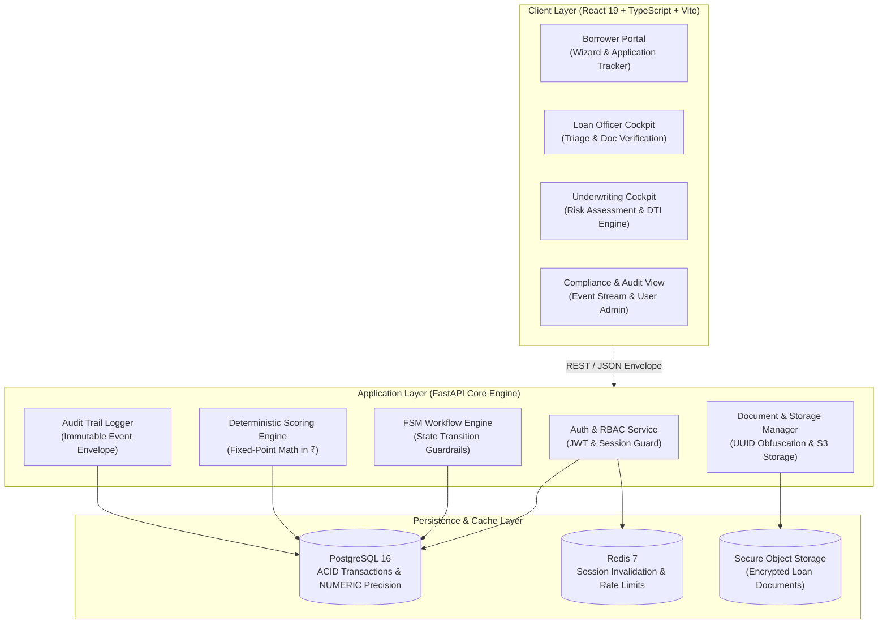
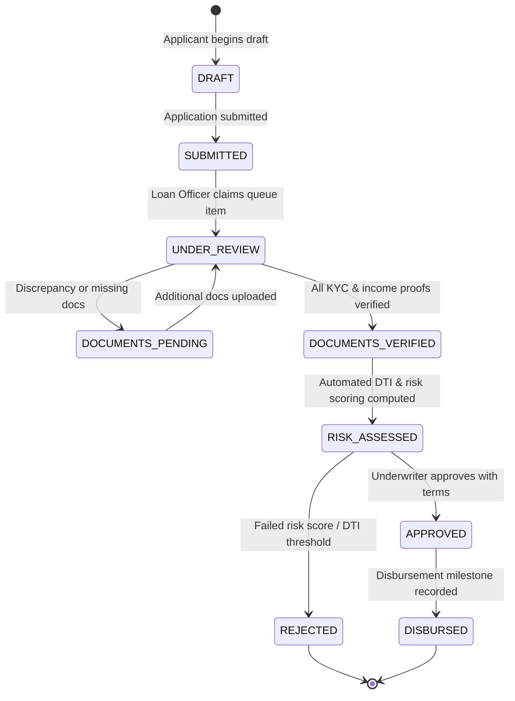

<div align="center">

# 🏛️ CredVidhi

### Enterprise-Grade Loan Origination, Risk Underwriting & Processing System

[](https://react.dev/)
[](https://www.typescriptlang.org/)
[](https://vite.dev/)
[](https://tailwindcss.com/)
[](https://www.framer.com/motion/)
[](https://opensource.org/licenses/MIT)
[](https://github.com/calligraphyguruji/CredVidhi)

<p align="center">
  <b>A deterministic, auditable, and secure financial platform designed for banks, NBFCs, and fintech lenders to automate the end-to-end credit origination lifecycle.</b>
</p>

[Key Features](#-key-capabilities) •
[Architecture](#-system-architecture) •
[Workflow & Lifecycle](#-loan-lifecycle-finite-state-machine) •
[Role Matrix](#-role-based-access-control-rbac) •
[Mathematical Engine](#-underwriting--financial-engine) •
[Quickstart](#-getting-started) •
[Documentation](#-governance--documentation)

---

</div>

## 📌 Executive Summary

Modern lending organizations suffer from fragmented communication between loan officers and underwriters, opaque risk models, document management bottlenecks, and high regulatory audit risk.

**CredVidhi** bridges this gap by replacing manual handoffs with a **deterministic, rule-driven, and immutable credit processing platform**. From digital borrower intake to rigorous document verification, real-time debt-to-income (DTI) computation, and underwriting governance, CredVidhi enforces zero floating-point drift, end-to-end traceability, and institutional security.

---

## ⚡ Key Capabilities

### 1. 🚀 Borrower Origination Portal
- **Guided Multi-Step Application Wizard:** Streamlined intake for Personal, Home, and Business loans.
- **Dynamic EMI & Loan Estimator:** Instant amortization and monthly payment preview calibrated in Indian Rupees (`₹`).
- **Secure Document Upload:** Support for identity, income proof, and bank statements with immediate file-type and size validation.
- **Real-Time Status Tracking:** Transparent borrower timeline tracking review stages, approval conditions, and disbursement milestones.

### 2. 📋 Officer Verification Cockpit
- **Unified Application Triage:** Filterable queues by status, loan category, risk grade, and date.
- **Interactive Document Verification Checklist:** Structured inspection for KYC, PAN, Aadhaar, salary slips, and ITR documents with discrepancy flagging.
- **Verification History & Notes:** Full reviewer notes trail appended to the application ledger.

### 3. ⚖️ Underwriting & Risk Cockpit
- **Deterministic Risk Scoring:** Mathematical assessment evaluating borrower liquidity, credit history, disposable income, and collateral.
- **Live Financial Breakdown:** Real-time Debt-to-Income (DTI) ratio tracking with visual warning thresholds.
- **Decision Engine with Guardrails:** One-click Approve, Reject, or Request Additional Information with mandatory justification logs.

### 4. 🛡️ Enterprise Audit & Compliance
- **Immutable Audit Logging:** Every status change, document verification, and underwriting decision creates an append-only audit log entry.
- **Role-Based Access Control (RBAC):** Strict boundaries separating Applicants, Loan Officers, Risk Analysts, and Administrators.
- **FinTech Motion System:** Restrained, accessible animations powered by Framer Motion (`prefers-reduced-motion` compliant).

---

## 🏗️ System Architecture

CredVidhi is architected with clear domain-driven boundaries, isolating client UI, application orchestration, financial calculations, and secure data persistence.



---

## 🔄 Loan Lifecycle (Finite State Machine)

Every loan application follows a non-reversible, deterministic state progression with strict rollback protections and atomic audit logging.



---

## 👥 Role-Based Access Control (RBAC)

CredVidhi strictly enforces privilege boundaries at both the route and API dependency layers:

| Capability / Resource | Applicant | Loan Officer | Risk Analyst | Administrator |
| :--- | :---: | :---: | :---: | :---: |
| **Create & Submit Application** | ✅ | ❌ | ❌ | ❌ |
| **View Personal Applications** | ✅ | ❌ | ❌ | ❌ |
| **View Assigned Processing Queue** | ❌ | ✅ | ✅ | ✅ |
| **Verify / Reject Uploaded Documents** | ❌ | ✅ | ❌ | ✅ |
| **Execute Financial Underwriting** | ❌ | ❌ | ✅ | ✅ |
| **Approve / Reject Loans** | ❌ | ❌ | ✅ | ✅ |
| **Record Disbursement** | ❌ | ❌ | ❌ | ✅ |
| **Inspect Immutable Audit Trail** | ❌ | ❌ | ❌ | ✅ |
| **Configure System Products & Limits** | ❌ | ❌ | ❌ | ✅ |

---

## 🧮 Underwriting & Financial Engine

### 1. Debt-to-Income (DTI) Ratio Formula

The Debt-to-Income ratio evaluates an applicant's capacity to service the proposed loan:

$$\text{DTI} = \left( \frac{\text{Total Existing Monthly Debts} + \text{Proposed Loan EMI}}{\text{Gross Monthly Income}} \right) \times 100$$

- **Default Approval Threshold:** $\le 45\%$
- **Conditional / Escalated Review:** $> 45\% \text{ and } \le 55\%$
- **Automatic Disqualification:** $> 55\%$

### 2. Equated Monthly Installment (EMI) Calculation

Fixed monthly repayment is calculated using standard compounding amortization:

$$\text{EMI} = P \times r \times \frac{(1 + r)^n}{(1 + r)^n - 1}$$

Where:
- $P$ = Principal loan amount
- $r$ = Monthly interest rate ($\frac{\text{Annual Interest Rate}}{12 \times 100}$)
- $n$ = Loan tenure in months

> **Financial Precision Invariant:** All calculations avoid IEEE 754 floating-point drift by utilizing fixed-point `Decimal` (Python) and scaled integers/BigNumber on the client side, formatted in Indian Rupees (`₹`).

---

## 💻 Tech Stack & Dependencies

| Area | Technology | Purpose |
| :--- | :--- | :--- |
| **Client UI** | [React 19](https://react.dev/) + [TypeScript](https://www.typescriptlang.org/) | Type-safe declarative frontend interface |
| **Build Tool** | [Vite 6](https://vite.dev/) | Sub-second HMR and optimized asset bundling |
| **Styling** | [Tailwind CSS 3.4](https://tailwindcss.com/) | Utility-first styling with custom Saffron design tokens |
| **Motion** | [Framer Motion 12](https://www.framer.com/motion/) | Restrained, enterprise-grade physics and micro-interactions |
| **Icons** | [Lucide React](https://lucide.dev/) | Clean, accessible vector UI icons |
| **Linter** | [oxlint](https://oxc-project.github.io/) | Ultra-fast static analysis and style verification |
| **Backend (Target)** | [FastAPI](https://fastapi.tiangolo.com/) (Python 3.11+) | Async REST API framework with Pydantic v2 validation |
| **ORM & Migrations** | [SQLAlchemy 2.0](https://www.sqlalchemy.org/) + [Alembic](https://alembic.sqlalchemy.org/) | Async database abstraction and version-controlled migrations |
| **Database** | [PostgreSQL 16](https://www.postgresql.org/) | Strict ACID storage with row-level locking and JSONB |
| **Cache & Sessions** | [Redis 7](https://redis.io/) | High-throughput session management & rate limiting |

---

## 📁 Repository Directory Structure

```text
CredVidhi/
├── README.md                  # Project overview, architecture & setup
├── .gitignore                 # Environment & dependency ignore rules
└── frontend/                  # React client application
    ├── src/
    │   ├── components/
    │   │   ├── landing/       # High-conversion FinTech landing page sections
    │   │   │   ├── HeroSection.tsx
    │   │   │   ├── LoanProductsGrid.tsx
    │   │   │   ├── WorkflowSection.tsx
    │   │   │   ├── ProductPreview.tsx
    │   │   │   └── SecurityTrustSection.tsx
    │   │   ├── layout/        # Header, Sidebar, and App Shell
    │   │   └── ui/            # Button, Input, Modal, Card, Toast, AnimatedCounter
    │   ├── context/           # AppState & Global Notification Toast Context
    │   ├── pages/
    │   │   ├── applicant/     # Borrower application portal & multi-step wizard
    │   │   ├── public/        # Landing page & Authentication portal
    │   │   └── staff/         # Officer Queue & Underwriting Cockpit
    │   └── utils/             # Motion tokens, easing curves, and currency helpers
    ├── package.json
    ├── tailwind.config.js
    └── vite.config.ts
```

---

## 🚀 Getting Started

### Prerequisites

- **Node.js**: `v18.0.0` or higher
- **npm** or **pnpm**
- **Git**

### 1. Clone & Setup

```bash
# Clone the repository
git clone https://github.com/calligraphyguruji/CredVidhi.git
cd CredVidhi

# Navigate to the frontend directory
cd frontend

# Install dependencies
npm install
```

### 2. Run Development Server

```bash
npm run dev
```

The application will be accessible at `http://localhost:5173`.

### 3. Build & Verification

```bash
# Typecheck and production bundle build
npm run build

# Run fast code quality linter
npm run lint

# Preview production build locally
npm run preview
```

---

## 🔒 Security & Compliance Principles

- **Zero Secrets in Code:** All credentials, keys, and tokens are validated through environment variables.
- **PII Data Masking:** Government identification numbers (PAN, Aadhaar, SSN) are masked in responses and logs (`***-**-1234`).
- **Cryptographic Storage:** Loan documents are stored using non-guessable UUID keys; original filenames are sanitized.
- **Append-Only Immutability:** Audit trail records cannot be updated or hard-deleted under any circumstance.
- **No Mock Integrity Compromises:** Deterministic score evaluators and local test harnesses are explicitly designated as internal engines and never misrepresented as live external credit bureaus.

---

## 📚 Governance & Standards

CredVidhi adheres to institutional-grade financial and operational specifications:

- **Deterministic Underwriting:** Reproducible mathematical risk assessment with zero IEEE 754 floating-point drift.
- **Strict Role-Based Access Control:** Hard boundaries separating Borrower, Officer, Underwriter, and Admin operations.
- **Audit Immutability:** Append-only transaction envelopes recording every lifecycle transition and reviewer note.
- **Non-Destructive Evolution:** Version-controlled database migrations with ACID transaction envelopes.
- **Quality Verification Gates:** Comprehensive type-checking, fast static linting (`oxlint`), and frontend build checks.

---

## 🤝 Contributing

1. Fork the repository
2. Create your feature branch (`git checkout -b feature/underwriting-matrix`)
3. Commit your changes using [Conventional Commits](https://www.conventionalcommits.org/) (`git commit -m 'feat(underwriter): add debt service coverage ratio calculation'`)
4. Verify all tests and lints pass (`npm run build && npm run lint`)
5. Push to the branch (`git push origin feature/underwriting-matrix`)
6. Open a Pull Request

---

## 📜 License

This project is licensed under the **MIT License** — see the [LICENSE](LICENSE) file for details.

<div align="center">
  <sub>Built with precision for modern financial institutions by <a href="https://github.com/calligraphyguruji">calligraphyguruji</a>.</sub>
</div>
