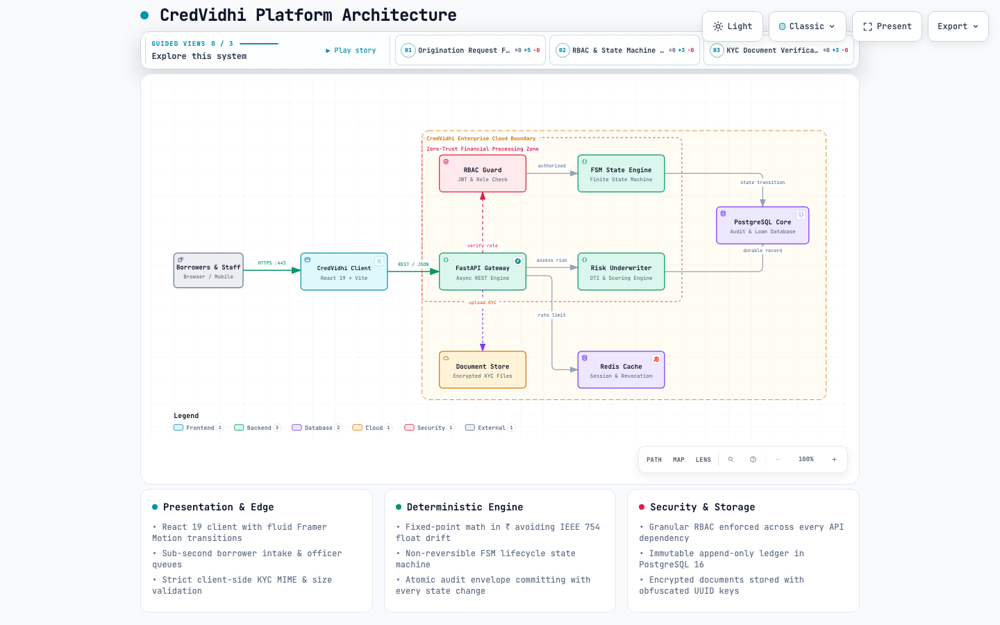
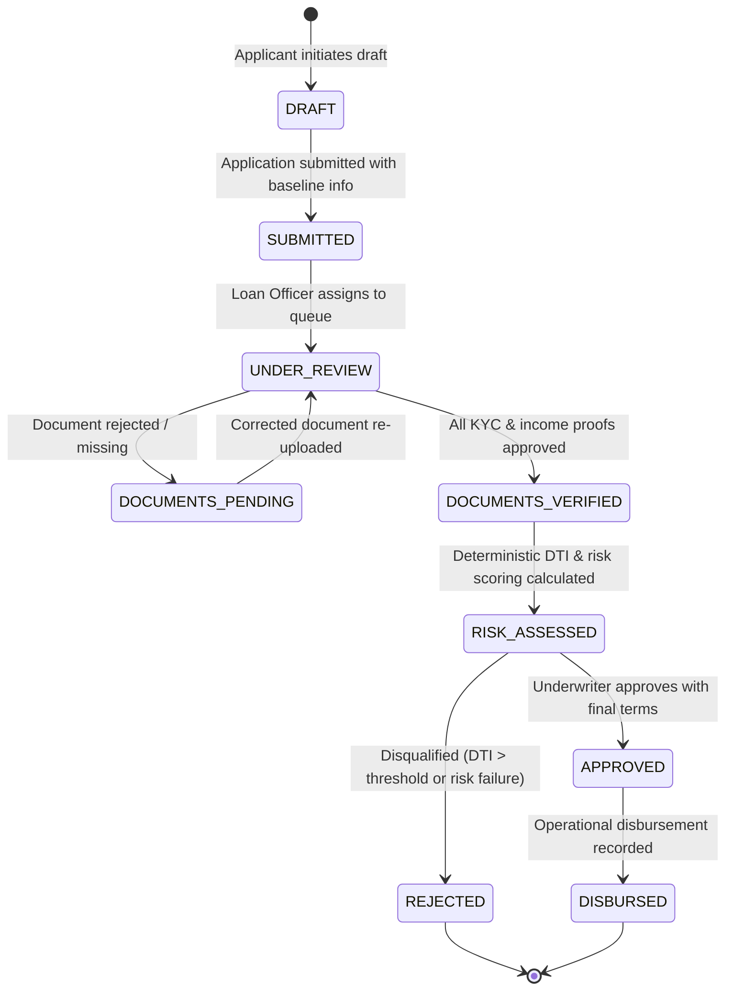

<div align="center">

# 🏛️ CredVidhi

### Enterprise-Grade Loan Origination, Risk Underwriting & Lifecycle Governance System

[](https://credvidhi.vercel.app)
[](https://fastapi.tiangolo.com/)
[](https://www.python.org/)
[](https://www.postgresql.org/)
[](https://redis.io/)
[](https://www.docker.com/)
[](https://react.dev/)
[](https://www.typescriptlang.org/)
[](https://vite.dev/)
[](https://tailwindcss.com/)
[](https://www.framer.com/motion/)
[](https://github.com/calligraphyguruji/CredVidhi)
[](https://opensource.org/licenses/MIT)

<p align="center">
  <b>A deterministic, auditable, and secure financial platform designed for banks, NBFCs, and digital lenders to automate the end-to-end retail and commercial credit origination lifecycle.</b>
</p>

<p align="center">
  🚀 <b>Live Interactive Application:</b> <a href="https://credvidhi.vercel.app"><b>https://credvidhi.vercel.app</b></a>
</p>

[🚀 Live Demo](https://credvidhi.vercel.app) •
[System Overview](#system-overview) •
[Interactive Sandbox](#live-demo) •
[Why CredVidhi](#why-credvidhi) •
[Core Workspaces](#core-workspaces) •
[Architecture](#system-architecture) •
[FSM Lifecycle](#loan-lifecycle) •
[Financial Engine](#underwriting-engine) •
[Role Matrix](#role-based-access-control) •
[API Specification](#standardized-api) •
[Quickstart](#getting-started) •
[Design System](#design-system)

</div>

---

<a id="system-overview"></a>
## 📌 System Overview

Modern lending institutions struggle with disconnected handoffs between sales officers, document clerks, and risk underwriters. Traditional manual pipelines result in high turnaround times (TAT), human-prone calculation errors, compliance vulnerabilities during audits, and opaque rejection rationales.

**CredVidhi** delivers a unified, high-trust digital origination platform that enforces **mathematical determinism, non-negotiable state machines, and immutable audit logging**.

Every calculation—from Debt-to-Income (DTI) and monthly compounding EMI amortization to risk scoring—is computed using fixed-point precision with strict zero-drift guarantees in **Indian Rupees (`₹`)**.

---

<a id="live-demo"></a>
## 🚀 Live Demo & Interactive Sandbox

Experience the complete end-to-end loan origination and underwriting flow live in your browser:

🔗 **Production URL:** [**https://credvidhi.vercel.app**](https://credvidhi.vercel.app)

### What You Can Experience in the Live Demo:
1. **Borrower Digital Intake & Registration:**
   - Click **"Apply for Loan"** to test the streamlined digital registration (`/register`) and explore loan products (Home, Auto, SME, Personal, Education).
   - Test the real-time compound interest EMI and DTI calculator with dynamic sliders.
2. **Deterministic Lifecycle Tracking:**
   - Click **"Track Application"** to sign in and monitor active loan files across all 5 transparent lifecycle states (`DRAFT` $\to$ `SUBMITTED` $\to$ `UNDER_REVIEW` $\to$ `APPROVED` $\to$ `DISBURSED`).
3. **AI Customer Support & Financial Advisor Chatbot:**
   - Open the floating **CredVidhi AI** assistant in the bottom right corner.
   - Powered by Google Gemini with domain boundaries and offline NLP fallbacks for interest rates, documents, CIBIL tiers, and application tracking.
   - Native **KaTeX LaTeX math typesetting** (`react-markdown` + `remark-math` + `rehype-katex`) for beautifully rendered mathematical amortization formulas (EMI, DTI, compounding schedules, Greek letters, superscripts, and fractions) alongside full Markdown support.
4. **Staff Verification & Underwriting Workspaces:**
   - Access **Staff SSO** to experience the Loan Officer triage queue, document verification checklists, quantitative underwriting cockpits, and immutable audit streams.
5. **Theme Switching:**
   - Seamlessly toggle between crisp institutional light mode and deep abstract geometric vortex dark mode.

---

<a id="why-credvidhi"></a>
## ⚖️ Why CredVidhi?

| Strategic Dimension | Traditional Manual Operations | CredVidhi Automated Platform |
| :--- | :--- | :--- |
| **Turnaround Time (TAT)** | 5 to 14 business days | **Under 24 hours** (Instant pre-qualification) |
| **Financial Calculations** | Manual spreadsheets (prone to IEEE 754 float drift) | **Deterministic fixed-point arithmetic** (`NUMERIC(14,2)`) |
| **Document Verification** | Disjointed email threads & physical paper folders | **Structured checklists & status-flagged queues** |
| **Risk Scoring** | Undocumented ad-hoc heuristics | **Reproducible mathematical scorecards** |
| **Audit Compliance** | Fragmented paper records & retrospective logs | **Cryptographic, append-only immutable event ledger** |
| **Security & Privacy** | Plaintext PII in email chains | **Masked PII (`***-**-1234`), encrypted document storage** |

---

<a id="core-workspaces"></a>
## 🖥️ Core Workspaces & UI Walkthrough

CredVidhi provides dedicated, purpose-built workspaces tailored to each key stakeholder in the lending lifecycle:

```text
┌─────────────────────────────────────────────────────────────────────────────┐
│                             CREDVIDHI ECOSYSTEM                             │
├──────────────────────┬──────────────────────┬───────────────────────────────┤
│   Borrower Portal    │  Officer Workbench   │      Underwriting Cockpit     │
│  • Digital Wizard    │  • Queue Management  │  • Real-Time DTI Assessment   │
│  • EMI Calculator    │  • KYC Checklist     │  • Disposable Income Analysis │
│  • Document Upload   │  • Discrepancy Flags │  • One-Click Decision Engine  │
│  • Status Timeline   │  • Application Notes │  • Policy Exception Audit     │
└──────────────────────┴──────────────────────┴───────────────────────────────┘
```

### 1. 🚀 Borrower Digital Intake Portal
- **Guided Multi-Step Application Wizard:** Contextual inputs for Personal, Home, and Business loans with inline validation.
- **Dynamic EMI & Loan Estimator:** Immediate payment preview calibrated to loan tenure, principal, and interest rate.
- **Secure Document Upload:** Instant client-side validation for KYC documents (PAN, Aadhaar, salary slips, ITR) with size and MIME-type restrictions.
- **Live Lifecycle Tracker:** Transparent, real-time visual progress tracker keeping applicants informed at every review gate.

### 2. 📋 Loan Officer Verification Cockpit
- **Unified Processing Queue:** Instant status filters (`SUBMITTED`, `UNDER_REVIEW`, `DOCUMENTS_PENDING`) with multi-column sorting.
- **Document Verification Workbench:** Side-by-side inspection checklist allowing officers to approve, reject, or request re-upload of specific documents with reviewer notes.
- **Discrepancy Triage:** Prevents applications from proceeding to credit assessment until mandatory verification criteria are met.

### 3. 📊 Quantitative Underwriting Cockpit
- **Live Financial Breakdown:** Real-time Debt-to-Income (DTI) ratio tracking against configurable policy limits ($\le 45\%$).
- **Disposable Income Surplus:** Computes net uncommitted monthly income to guarantee debt servicing cushion.
- **Deterministic Risk Scoring:** Mathematical grading evaluating liquidity, repayment history, income stability, and collateral coverage.
- **Guarded Decision Actions:** Direct approval/rejection actions requiring mandatory written justifications logged into the immutable audit trail.

### 4. 🛡️ Compliance & Immutable Audit Stream
- **Event-Driven Audit Stream:** Chronological event feed capturing actor ID, timestamp, prior state, subsequent state, and IP context.
- **Non-Destructive Data Retention:** Strictly prohibits hard deletes; superseded applications and cancelled workflows are archived immutably.

### 5. ⚙️ Institutional Product Catalog & Policy Management
- **Configurable Lending Guidelines:** Define and update allowable principal ranges, tenor brackets, base APRs, and hard DTI threshold caps.
- **Mandatory Document Checklist Engine:** Dynamically attach required document types and verification criteria to individual loan products.
- **Lifecycle Activation Controls:** Toggle active/inactive catalog availability without destructive schema mutations.

### 6. 👥 Identity & Access Management (RBAC) & User Administration
- **Staff & Borrower Profile Management:** Provision, view, and administer users across `LOAN_OFFICER`, `RISK_ANALYST`, `APPLICANT`, and `ADMIN` roles.
- **Dynamic Role Elevation & Suspension:** Instant account activation or suspension and cryptographic role reassignment.
- **Sortable & Filterable Data Grid:** Powered by reusable `DataTable` with multi-field search and column-level sorting.

### 7. 🤖 AI Customer Support & Financial Advisor Chatbot
- **Google Gemini 3.8 Flash Integration:** Powered by Google Gemini (or any OpenAI-compatible provider) via secure server-side proxy.
- **Strict Domain Guardrail & Anti-Abuse Firewall:** Enforces dual-layer scope restriction (pre-filter classifier + prompt boundary) ensuring Gemini is exclusively utilized for CredVidhi lending, loan products, application status tracking, eligibility, and underwriting queries, rejecting unrelated prompts (coding, trivia, entertainment) to prevent token waste and API misuse.
- **Real-Time Application Status Tracking:** Natural language tracking assistance guiding applicants through the 5-stage lifecycle (`DRAFT` → `SUBMITTED` → `UNDER_REVIEW` → `APPROVED` → `DISBURSED`) with reference number lookups.
- **Offline High-Resilience Fallback:** Automatically serves deterministic grounded answers covering products, interest rates, documents, CIBIL score tiers, and EMI calculations if offline or without external API keys.
- **Floating Omnipresent Widget:** Saffron-themed conversational assistant accessible from landing, portal, and workbench pages.

---

<a id="system-architecture"></a>
## 🏗️ System Architecture

CredVidhi enforces clear domain-driven separation between the user interface, orchestration engine, financial calculations, and persistent storage:

<div align="center">
  <picture>
    <source media="(prefers-color-scheme: dark)" srcset="docs/architecture-dark.png">
    <source media="(prefers-color-scheme: light)" srcset="docs/architecture.png">
    
  </picture>
  <p align="center">
    <sub>Generated with <b>Archify</b>. An interactive standalone diagram with guided chapters, focus tracing, and theme switching is available at <a href="docs/architecture.html"><code>docs/architecture.html</code></a>.</sub>
  </p>
</div>

### Architectural Segregation & Trust Zones:

1. **Presentation & Edge Layer:** Single-page application built on **React 19**, **TypeScript**, and **Tailwind CSS**. Fluid micro-interactions and transitions powered by **Framer Motion** with strict `prefers-reduced-motion` compliance.
2. **Security & Boundary Guard:** **RBAC Guard** terminates TLS 1.3, verifies signed JWT tokens, and validates actor roles before any request enters internal processing.
3. **Application Orchestration:** **FastAPI Core Gateway** serves as the asynchronous controller, enforcing request validation with Pydantic v2.
4. **Zero-Trust Financial Processing Zone:**
   - **FSM State Engine:** Enforces forward-only, non-reversible application status transitions within strict ACID transaction envelopes.
   - **Deterministic Underwriting Engine:** Evaluates Debt-to-Income (DTI), EMI amortization, and risk scores using fixed-point precision in Indian Rupees (`₹`).
5. **Persistence & Cache Layer:**
   - **PostgreSQL 16:** Append-only ledger storing immutable audit logs, loan applications, and reviewer decisions.
   - **Redis 7:** High-throughput token revocation and rate-limiting cache.
   - **Encrypted Object Store:** S3-compatible sandboxed document repository storing KYC records under non-guessable UUID keys.

---

<a id="loan-lifecycle"></a>
## 🔄 Loan Lifecycle (Finite State Machine)

Every loan application transitions through a strictly non-reversible sequence governed by database ACID transaction envelopes:



### State Transition Validation Invariants:
1. **No Forward Skipping:** An application cannot transition from `SUBMITTED` directly to `APPROVED`.
2. **Document Prerequisite:** An application cannot move to `RISK_ASSESSED` unless status is `DOCUMENTS_VERIFIED`.
3. **Atomic Audit Logging:** State change and audit log record must be committed within the same database transaction; failure to persist audit rolls back the state change.

---

<a id="underwriting-engine"></a>
## 🧮 Underwriting & Financial Engine

### 1. Debt-to-Income (DTI) Ratio

The Debt-to-Income ratio evaluates an applicant's capacity to service proposed debt obligations against verified monthly income:

$$\text{DTI} = \left( \frac{\text{Total Existing Monthly Debts} + \text{Proposed Loan EMI}}{\text{Gross Monthly Income}} \right) \times 100$$

#### Regulatory & Policy Thresholds:
- **Prime Tier ($\text{DTI} \le 45\%$):** Standard automated eligibility.
- **Conditional Tier ($45\% < \text{DTI} \le 55\%$):** Requires senior underwriter signoff or additional collateral.
- **Disqualified Tier ($\text{DTI} > 55\%$):** Automated rejection due to excessive debt burden.

---

### 2. Equated Monthly Installment (EMI) Formula

Fixed monthly repayment is calculated using standard compounding amortization:

$$\text{EMI} = P \times r \times \frac{(1 + r)^n}{(1 + r)^n - 1}$$

Where:
- $P$ = Principal loan amount in Rupees (`₹`)
- $r$ = Periodic monthly interest rate ($\frac{\text{Annual Interest Rate}}{12 \times 100}$)
- $n$ = Loan tenure in months

---

### 3. Disposable Monthly Income Surplus

Evaluates net buffer remaining after all living expenses and total debt commitments:

$$\text{Disposable Income} = \text{Gross Monthly Income} - (\text{Existing Debts} + \text{Proposed EMI} + \text{Living Expenses})$$

> **Zero Floating-Point Drift Invariant:** All calculations avoid IEEE 754 precision issues by utilizing fixed-point `Decimal` (Python) and scaled integer arithmetic on the client, standardizing on Indian Rupees (`₹`).

---

<a id="role-based-access-control"></a>
## 👥 Role-Based Access Control (RBAC)

CredVidhi implements granular, defense-in-depth role authorization:

| Capability / Operational Action | Applicant | Loan Officer | Risk Underwriter | Compliance Admin |
| :--- | :---: | :---: | :---: | :---: |
| **Initiate & Edit Draft Application** | ✅ | ❌ | ❌ | ❌ |
| **Submit Application & Upload KYC** | ✅ | ❌ | ❌ | ❌ |
| **Track Personal Application Status** | ✅ | ❌ | ❌ | ❌ |
| **Triage Application Processing Queue** | ❌ | ✅ | ✅ | ✅ |
| **Inspect & Verify Uploaded Documents** | ❌ | ✅ | ❌ | ✅ |
| **Flag Document Discrepancy** | ❌ | ✅ | ❌ | ✅ |
| **Trigger Deterministic Risk Assessment** | ❌ | ❌ | ✅ | ✅ |
| **Issue Final Approval / Rejection** | ❌ | ❌ | ✅ | ✅ |
| **Record Disbursement Milestone** | ❌ | ❌ | ❌ | ✅ |
| **Configure Loan Products & Limits** | ❌ | ❌ | ❌ | ✅ |

### Protected Routes & Redirect Intent Preservation:
- **Zero Authentication Bypass:** All internal workflow interfaces, staff workbenches, and borrower dashboards are strictly guarded. Unauthenticated visitors clicking workflow CTAs (e.g., *Launch Digital Application Interface*, *Launch Queue Triage & Locking Interface*) are securely routed to `/register` (with instant toggle to `/login`).
- **Target Intent Persistence:** The user's intended destination is preserved across the registration or sign-in flow (`?redirect=...` and session state). Upon successful authentication, authorized users are automatically directed to their requested interface.
- **Strict Persona Verification:** Authenticated users attempting to enter workbenches outside their authorized role are prevented from bypassing RBAC and shown an explicit access denial notification without silent role mutation.

---

<a id="standardized-api"></a>
## 📡 Standardized API & Error Envelope

All client-server communication utilizes predictable HTTP response codes and a strict response envelope:

### Success Response Envelope
```json
{
  "success": true,
  "data": {
    "application_id": "app_9f8d1c7e",
    "status": "DOCUMENTS_VERIFIED",
    "calculated_dti": 38.5,
    "max_eligible_amount": 750000,
    "evaluated_at": "2026-09-27T04:10:00Z"
  },
  "error": null
}
```

### Standardized Error Envelope
```json
{
  "success": false,
  "data": null,
  "error": {
    "code": "DTI_THRESHOLD_EXCEEDED",
    "message": "Calculated Debt-to-Income ratio (58.2%) exceeds maximum allowable threshold (45.0%).",
    "details": {
      "calculated_dti": 58.2,
      "max_threshold": 45.0,
      "gross_monthly_income": 85000,
      "total_monthly_debt": 49500
    }
  }
}
```

### Core API Endpoints

| Domain | Method | Endpoint | Authorized Roles | Description |
| :--- | :--- | :--- | :--- | :--- |
| **Auth** | `POST` | `/api/v1/auth/register` | Public | Register new borrower account |
| **Auth** | `POST` | `/api/v1/auth/login` | Public | Authenticate user & issue JWT tokens |
| **Auth** | `POST` | `/api/v1/auth/forgot-registration` | Public (Rate Limited) | Verify borrower identity & issue OTP challenge for reference recovery |
| **Auth** | `POST` | `/api/v1/auth/verify-registration-otp` | Public (Rate Limited) | Validate OTP & securely deliver application reference number |
| **Auth** | `POST` | `/api/v1/auth/refresh` | Authenticated | Rotate refresh token & issue new access token |
| **Auth** | `POST` | `/api/v1/auth/logout` | Authenticated | Revoke tokens via Redis JTI blacklist |
| **Auth** | `GET` | `/api/v1/auth/me` | Authenticated | Get current authenticated profile |
| **Products** | `GET` | `/api/v1/products` | Public | List active loan products & financial limits |
| **Products** | `POST` | `/api/v1/products` | `ADMIN` | Configure new loan product |
| **Applications** | `POST` | `/api/v1/applications` | `APPLICANT`, `ADMIN` | Initialize new loan application draft |
| **Applications** | `PUT` | `/api/v1/applications/{id}/draft` | `APPLICANT`, `ADMIN` | Auto-save draft parameters & financial snapshots |
| **Applications** | `POST` | `/api/v1/applications/{id}/submit` | `APPLICANT`, `ADMIN` | Formally submit draft & generate reference number |
| **Applications** | `GET` | `/api/v1/applications/{id}` | Owner or Staff | Retrieve comprehensive application state & history |
| **Applications** | `POST` | `/api/v1/applications/{id}/transition` | Role Guarded | Execute verified FSM transition with audit entry |
| **Applications** | `POST` | `/api/v1/applications/{id}/cancel` | `APPLICANT`, `OFFICER`, `ADMIN` | Cancel active application with audit reason |
| **Queues** | `GET` | `/api/v1/queues/applicant` | `APPLICANT` | Paginated borrower application history |
| **Queues** | `GET` | `/api/v1/queues/officer` | `LOAN_OFFICER`, `ADMIN` | Intake triage queue (`SUBMITTED`, `UNDER_REVIEW`, `DOCUMENTS_PENDING`) |
| **Queues** | `GET` | `/api/v1/queues/underwriter` | `RISK_ANALYST`, `ADMIN` | Underwriting queue (`DOCUMENTS_VERIFIED`, `RISK_ASSESSED`) |
| **Queues** | `GET` | `/api/v1/queues/disbursement` | `OPERATIONS`, `ADMIN` | Settlement queue (`APPROVED`) |
| **Documents** | `POST` | `/api/v1/applications/{id}/documents/presign` | `APPLICANT`, `ADMIN` | Generate secure time-limited presigned S3/MinIO upload URL |
| **Documents** | `POST` | `/api/v1/applications/{id}/documents/confirm` | `APPLICANT`, `ADMIN` | Register uploaded document metadata with SHA-256 integrity hash |
| **Documents** | `POST` | `/api/v1/applications/{id}/documents/upload` | `APPLICANT`, `ADMIN` | Direct chunked multipart upload with magic byte inspection |
| **Documents** | `GET` | `/api/v1/applications/{id}/documents` | Owner or Staff | List uploaded documents with concurrent presigned download URLs |
| **Documents** | `GET` | `/api/v1/applications/{id}/documents/checklist` | Owner or Staff | Real-time product checklist evaluation (required vs verified) |
| **Documents** | `POST` | `/api/v1/documents/{id}/verify` | `LOAN_OFFICER`, `ADMIN` | Officer audit gate (`VERIFIED`, `DEFICIENT`) with automated FSM advancement |
| **Underwriting** | `POST` | `/api/v1/applications/{id}/evaluate` | `RISK_ANALYST`, `ADMIN` | Trigger deterministic financial underwriting & risk scorecard evaluation |
| **Underwriting** | `GET` | `/api/v1/applications/{id}/assessment` | Owner or Staff | Inspect financial metrics (DTI, EMI, surplus, score factors, amortization preview) |
| **Underwriting** | `POST` | `/api/v1/applications/{id}/decision` | `RISK_ANALYST`, `ADMIN` | Record formal credit decision (`APPROVED`, `REJECTED`) with supervisor escalation |
| **Compliance & Audit** | `GET` | `/api/v1/audit/logs` | `ADMIN`, `OPERATIONS` | Query tamper-proof chronological audit ledger with multi-attribute filtering |
| **AI Support Chat** | `POST` | `/api/v1/chat` | Public / Authenticated | Google Gemini customer support & loan inquiries with grounded knowledge fallback |

---

<a id="design-system"></a>
## 🎨 Design System & Motion Principles

CredVidhi's design language combines institutional banking reliability with high-efficiency SaaS ergonomics:

### 1. Color Palette & Token System
- **Primary / Brand Saffron:** `#EA580C` (`orange-600` / `dark:text-orange-400`) — Represents trust, dynamism, and authentic financial identity.
- **Dark Neutral / Charcoal:** `#0F172A` (`slate-900`) & `#020617` (`slate-950`) — High-contrast typography and deep framing in dark mode.
- **Surface & Backgrounds:** `#F8FAFC` (`slate-50`) & `#FFFFFF` in light mode; `#0F172A` (`slate-900`) & `#020617` (`slate-950/70`) in dark mode.
- **Success / Approval:** `#059669` (`emerald-600` / `dark:text-emerald-400`) — Verified KYC and approved underwriting.
- **Warning / Pending:** `#D97706` (`amber-600` / `dark:text-amber-400`) — Incomplete documentation and escalated review.
- **Destructive / Rejection:** `#DC2626` (`red-600` / `dark:text-rose-400`) — Failed credit assessment and rejected applications.

### 2. Dual-Theme Dark Mode Architecture
- **Unified Contrast Standard:** Full WCAG AA contrast compliance across both light and dark themes (> 7:1 for text and semantic badges; > 12:1 for primary headings).
- **Source-Level Semantic Styling:** Zero flashy white backgrounds or low-contrast text leaks in dark mode across all authenticated modules:
  - App Shell & Navigation: Dark navy app-shell (`dark:bg-slate-950`), header, sidebar, active docket telemetry, and role switcher.
  - Interactive Workspaces: Queue tables, Document Workbench, Underwriting Cockpit, Borrower Portal wizard, Compliance Audit journal, Product Catalog, and User Administration.
  - UI Primitives: Base `Card`, `Badge`, `Button`, `DataTable`, `Modal`, `Input`, `select`, and `textarea` components implement unified `dark:*` token pairings.
  - Form Controls & Autofill Protection: `color-scheme: dark` declarations prevent browser dropdowns and autofill overlays from flashing stark white backgrounds.

### 3. Motion System (Framer Motion)
- **Fast, Restrained Transitions:** 200–350ms with custom easing curves (`[0.16, 1, 0.3, 1]`) to provide immediate feedback without visual latency.
- **Micro-Interactions:** Subtle button tap feedback (`scale: 0.98`), card hover lift (`y: -2px`), and sliding active menu indicators (`layoutId`).
- **Full Accessibility:** Strict adherence to `prefers-reduced-motion` across all components; disables transforms while maintaining subtle opacity transitions.

---

## 💻 Tech Stack & Tooling

| Domain | Technology | Justification & Architecture Role |
| :--- | :--- | :--- |
| **Frontend Framework** | [React 19](https://react.dev/) | High-performance component rendering with concurrent features |
| **Language** | [TypeScript 5.x](https://www.typescriptlang.org/) | End-to-end static type safety and contract enforcement |
| **Bundler & Tooling** | [Vite 6](https://vite.dev/) | Instant Hot Module Replacement (HMR) and optimized rollup bundle |
| **Styling** | [Tailwind CSS 3.4](https://tailwindcss.com/) | Atomic CSS engine with custom Saffron design tokens |
| **Motion** | [Framer Motion 12](https://www.framer.com/motion/) | Production-grade physics and accessible animations |
| **Icons** | [Lucide React](https://lucide.dev/) | Consistent, accessible fintech vector icons |
| **Linter** | [oxlint](https://oxc-project.github.io/) | Ultra-fast Rust-based static analyzer with 116 active rules |
| **Target Backend** | [FastAPI](https://fastapi.tiangolo.com/) | High-throughput asynchronous Python 3.11+ web framework |
| **Database** | [PostgreSQL 16](https://www.postgresql.org/) | Strict ACID guarantees, row-level locking, and JSONB auditing |
| **Cache & Queue** | [Redis 7](https://redis.io/) | High-speed session invalidation and rate limiting |

---

<a id="getting-started"></a>
## 🚀 Getting Started

### Prerequisites

- **Python**: `v3.11` or higher (with [`uv`](https://docs.astral.sh/uv/) recommended)
- **Node.js**: `v18.0.0` or higher & `npm` / `pnpm`
- **Docker & Docker Compose** (for PostgreSQL 16, Redis 7 & MinIO S3)
- **Git**

---

### Backend Service Setup & Deployment Runbook

```bash
# 1. Enter backend directory
cd backend

# 2. Spin up local containerized infrastructure (PostgreSQL 16, Redis 7, MinIO S3)
docker compose up -d

# 3. Create virtual environment and install dependencies
uv venv
source .venv/bin/activate
uv pip install -e ".[dev]"

# 4. Run version-controlled Alembic database migrations
alembic upgrade head

# 5. Seed database with institutional accounts & loan products
python -m app.scripts.seed_db

# 6. Start development API server
uvicorn app.main:app --reload --port 8000
```

- **Interactive API Documentation:** [http://localhost:8000/docs](http://localhost:8000/docs)
- **Service Health Check:** [http://localhost:8000/api/v1/health](http://localhost:8000/api/v1/health)
- **MinIO Storage Console:** [http://localhost:9001](http://localhost:9001)

#### Backend Quality & Verification Gates

```bash
# Run complete test suite (65 tests covering Auth, RBAC, Health, FSM, Queues, S3 Document Storage, Deterministic Financial Math & Underwriting, Immutable Audit Ledger, PII Redaction & Full E2E Lifecycle)
pytest -v

# Run static type checking
mypy app tests

# Run linter and formatting checks
ruff check . && ruff format --check .
```

#### 🚀 Render Cloud Deployment (Infrastructure as Code)

CredVidhi includes a production [`render.yaml`](file:///Users/calligraphyguruji/CredVidhi/render.yaml) Blueprint for 1-click cloud deployments on Render:

1. Connect the repository to [Render](https://dashboard.render.com/blueprints).
2. Render detects `render.yaml` automatically and configures:
   - **Runtime:** Multi-stage Docker build targeting `backend/Dockerfile`
   - **Dynamic Port:** Adapts to Render's allocated `$PORT` (`0.0.0.0:${PORT:-8000}`)
   - **Health Probe:** Lightweight `/api/v1/health/live` probe
   - **Boot Sequence:** Safe migrations + non-blocking background benchmark seeder
   - **Secrets:** Auto-generates cryptographic 256-bit `JWT_SECRET`
3. Enter your managed PostgreSQL URL (e.g. Supabase, Neon, or Render Postgres) when prompted.

---

### Frontend Client Setup & Dual-Mode Engine

The frontend features a **Dual-Mode Hybrid Architecture**:
1. **Live REST Mode:** Connects directly to the FastAPI `/api/v1` backend using a zero-dependency native `fetch` client with JWT authentication, standardized error envelopes, and automated optimistic mutations.
2. **Autonomous Local Engine Mode:** If the backend is not running or network connectivity drops, the client autonomously falls back to its local deterministic financial math, in-memory FSM state machine, and localStorage persistence without white-screens or degraded UX.
3. **Live Indicator & Re-Probe:** The application header displays a live `Live API` (green) / `Local Mode` (gray) badge that users can click at any time to re-probe backend health.
4. **Protected Route Architecture & Auth Guards:** All internal application, queue, and workbench views (`/officer-queue`, `/document-workbench`, `/underwriting-cockpit`, `/borrower-portal`, `/compliance-audit`, `/loan-products`, `/user-admin`) are strictly protected via multi-layered route guards (`ProtectedRoute` component, URL resolver checks, and authenticated session state). Unauthenticated visitors attempting to access internal features from landing page CTAs, direct URLs, or page reloads are securely routed to `/register`.

```bash
# 1. Enter frontend directory
cd frontend

# 2. Install dependencies
npm install

# 3. Configure environment (optional, defaults to http://localhost:8000/api/v1)
# echo "VITE_API_BASE_URL=http://localhost:8000/api/v1" > .env.local

# 4. Start local development server
npm run dev
```

Open [http://localhost:5173](http://localhost:5173) in your browser.

#### Frontend Quality & Build Verification

```bash
# Run unit test suite (routing & authentication guards)
npm test

# Run TypeScript static type check
npm run typecheck

# Run production build and TypeScript compilation
npm run build

# Run fast code quality linter
npm run lint

# Preview production build locally
npm run preview
```

---

<a id="repository-structure"></a>
## 📁 Repository Structure

```text
CredVidhi/
├── README.md                      # Comprehensive project documentation & architecture
├── LICENSE                        # Open-source MIT License
├── .gitignore                     # Git ignore rules for dependencies & environments
├── docs/                          # Architecture diagrams & platform previews
│   ├── credvidhi-preview.png      # High-resolution platform preview
│   ├── architecture.html          # Standalone interactive Archify viewer
│   ├── architecture.json          # Archify system architecture specification
│   ├── architecture.png           # High-resolution light architecture diagram
│   └── architecture-dark.png      # High-resolution dark architecture diagram
├── render.yaml                    # Render Blueprint Infrastructure as Code specification
├── vercel.json                    # Vercel deployment rewrites, caching & security headers
├── backend/                       # Production FastAPI backend application
│   ├── app/
│   │   ├── api/v1/                # Health, Auth, and Product Catalog routers
│   │   ├── core/                  # Security (Argon2/JWT), Redis cache, structured logging & envelopes
│   │   ├── models/                # SQLAlchemy 2.0 Async domain entities (User, Product, Application, Document, Risk, Decision, Audit)
│   │   ├── schemas/               # Pydantic v2 DTOs with validation rules
│   │   ├── scripts/               # Idempotent database seeding script (seed_db.py)
│   │   ├── config.py              # Pydantic Settings with production secret guards
│   │   ├── database.py            # Async engine, sessionmaker, and health probes
│   │   ├── dependencies.py        # Token validation and RBAC guards (require_roles)
│   │   └── main.py                # FastAPI application factory & exception envelopes
│   ├── alembic/                   # Async database migration environment
│   │   └── versions/              # Reversible migration scripts (0001_initial_schema.py)
│   ├── tests/                     # Pytest async test suite (test_health.py, test_auth_rbac.py)
│   ├── docker-compose.yml         # Postgres 16, Redis 7, MinIO S3 & Backend orchestration
│   ├── Dockerfile                 # Hardened multi-stage Python 3.11 container with pinned uv
│   └── pyproject.toml             # Python package definition & lint/type configuration
└── frontend/                      # Production React client application
    ├── public/                    # Static vector assets, favicons, robots.txt, sitemap.xml
    ├── src/
    │   ├── assets/                # Platform previews & brand visual assets
    │   ├── components/            # High-conversion landing & workspace sections
    │   ├── context/               # Global AppState & Toast Notification Context
    │   ├── pages/                 # Applicant, Staff, Admin & Public workspaces
    │   ├── services/              # API Client & deterministic evaluation engines
    │   ├── types/                 # Application TypeScript Interfaces & Domain Models
    │   └── utils/                 # Motion tokens, easing curves, and currency math
    ├── package.json
    ├── tailwind.config.js
    └── vite.config.ts
```

---

<a id="security-compliance"></a>
## 🔒 Security & Institutional Compliance

- **Zero Hardcoded Secrets:** All credentials, keys, and tokens are injected via environment variables.
- **PII Masking by Default:** National identifiers (PAN, Aadhaar) are masked in responses and logs (`***-**-1234`).
- **File Obfuscation:** Stored loan documents use secure, non-guessable UUID keys; original filenames are sanitized.
- **Append-Only Immutability:** Audit records and state logs cannot be altered or deleted.
- **Truth in Simulation:** Deterministic internal score evaluators are explicitly designated as internal engines and never misrepresented as live external credit bureaus.

---

<a id="contributing"></a>
## 🤝 Contributing

1. Fork the repository
2. Create your feature branch (`git checkout -b feat/credit-bureau-simulator`)
3. Commit your changes following [Conventional Commits](https://www.conventionalcommits.org/):
   ```bash
   git commit -m 'feat(underwriting): add loan-to-value (LTV) calculation support'
   ```
4. Run verification gates (`npm run build && npm run lint`)
5. Push to the branch (`git push origin feat/credit-bureau-simulator`)
6. Open a Pull Request

---

<a id="license"></a>
## 📜 License

This project is open-source and licensed under the **[MIT License](LICENSE)**.

```text
MIT License

Copyright (c) 2026 calligraphyguruji

Permission is hereby granted, free of charge, to any person obtaining a copy
of this software and associated documentation files (the "Software"), to deal
in the Software without restriction, including without limitation the rights
to use, copy, modify, merge, publish, distribute, sublicense, and/or sell
copies of the Software, and to permit persons to whom the Software is
furnished to do so, subject to the following conditions:

The above copyright notice and this permission notice shall be included in all
copies or substantial portions of the Software.

THE SOFTWARE IS PROVIDED "AS IS", WITHOUT WARRANTY OF ANY KIND, EXPRESS OR
IMPLIED, INCLUDING BUT NOT LIMITED TO THE WARRANTIES OF MERCHANTABILITY,
FITNESS FOR A PARTICULAR PURPOSE AND NONINFRINGEMENT. IN NO EVENT SHALL THE
AUTHORS OR COPYRIGHT HOLDERS BE LIABLE FOR ANY CLAIM, DAMAGES OR OTHER
LIABILITY, WHETHER IN AN ACTION OF CONTRACT, TORT OR OTHERWISE, ARISING FROM,
OUT OF OR IN CONNECTION WITH THE SOFTWARE OR THE USE OR OTHER DEALINGS IN THE
SOFTWARE.
```

### Permissions & Guidelines:
- ✅ **Commercial Use:** Permitted for private enterprise and commercial deployments.
- ✅ **Modification:** The codebase can be adapted, extended, and modified.
- ✅ **Distribution:** Source code and binaries can be distributed freely.
- ✅ **Private Use:** Unrestricted internal deployment within organizations.
- ℹ️ **Attribution Notice:** The original copyright notice and permission notice must be preserved in all distributions.

<div align="center">
  <sub>Engineered with precision for modern financial institutions by <a href="https://github.com/calligraphyguruji">calligraphyguruji</a>.</sub>
</div>
